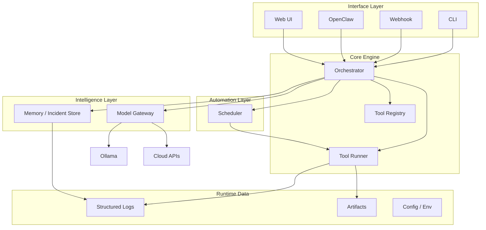
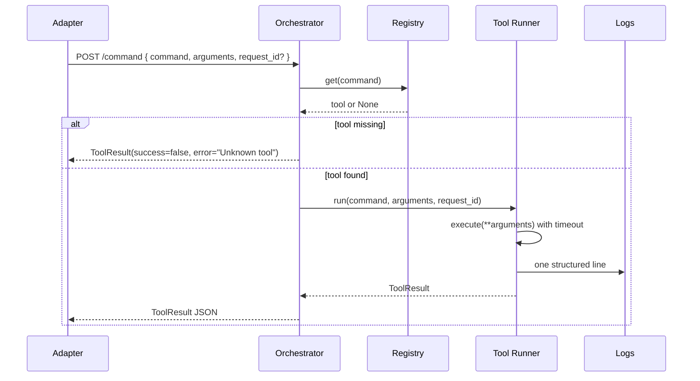

# AI-CORE Architectural Plan and Evolution Roadmap

This document defines how AI-CORE should evolve from its current minimal state into a robust, local-first AI orchestration platform. It is strategic only; implementation of phases follows the phased roadmap below and [docs/next_phase_plan.md](next_phase_plan.md) for immediate next steps.

---

## 1. Executive vision

AI-CORE is not a chatbot. It is the seed of a **local-first AI operating layer**: a single control plane that receives commands from multiple interfaces, runs tools and automations, logs and remembers what happened, and over time can use structured memory and model-backed reasoning to improve operations. The end state is an ecosystem where tools, schedules, incidents, and fixes are first-class; where Ollama (and later cloud models) are one pluggable capability; and where interfaces like OpenClaw or a web UI are clients of a stable core, not the foundation everything else depends on. The vision is built carefully from a small, debuggable local core so that complexity is added only when justified and each layer stays explicit and testable.

---

## 2. System goals

- **Receive commands** from multiple interfaces (CLI, webhook, OpenClaw, future web UI) without coupling the core to any one of them.
- **Orchestrate tools** via a single execution path: register, run with timeout, return structured results, log every run.
- **Run useful operational tasks** (healthchecks, reports, remediation, validation) as tools, not ad-hoc scripts.
- **Log structured events** so every command and tool run is traceable and queryable.
- **Track incidents and failed runs** in a dedicated store so fixes and patterns can be recorded and reused.
- **Learn from previous failures and fixes** over time via structured memory and optional model-assisted suggestions, without pretending this is solved on day one.
- **Schedule recurring tasks** (cron-like or simple queues) so the platform can drive automation, not only on-demand commands.
- **Expose a stable control surface** for remote access (API-first; UIs and adapters consume the same contract).
- **Integrate with Ollama** (and later cloud models) through a model gateway so reasoning is a capability, not wired through the whole codebase.
- **Support adapters** (OpenClaw, CLI, webhook, web UI) as interface layers that translate into the same command contract.
- **Evolve toward an ecosystem** where tools can improve each other through structured memory, testing, and validation, added incrementally.

---

## 3. Architectural principles

- **Local-first**: Default run on a single machine; data and control stay local; remote access is an option over a stable API, not the base assumption.
- **Modular services**: Orchestrator, runner, registry, scheduler, memory, gateway, adapters are distinct concerns with clear boundaries and contracts.
- **Explicit over magical**: No hidden state, no framework magic; contracts (request/response, ToolResult, log shape) are documented and stable.
- **Simple before complex**: Add scheduler, memory, learning, or adapters only when the previous layer is stable and useful.
- **Tool-based execution**: All operational work is done by registered tools; the runner enforces timeout, logging, and structured results.
- **Structured results and logging**: ToolResult and one structured log line per run are the norm; observability builds on this.
- **Debuggability**: Single execution path, request_id correlation, no unnecessary abstraction; when something fails, the path is obvious.
- **Low hidden complexity**: Prefer in-process, single-process, and SQLite before introducing queues, workers, or distributed components.
- **Separation of code, configuration, and runtime data**: Repo holds code and default config; `.env` and `data/` hold secrets and runtime state (gitignored).
- **Platform independence**: Prefer portable choices (Python, SQLite, file-based logs) so the core can run on Windows, macOS, Linux.
- **Minimal lock-in**: Model gateway abstracts Ollama/cloud; adapter layer abstracts OpenClaw/CLI/web; no single interface or provider is the foundation.

---

## 4. Big-picture target architecture

- **Interfaces** send commands (or equivalent) into the **orchestrator**. They do not contain business logic; they translate user or external input into the same command contract.
- **Core engine** (orchestrator, registry, runner) is the only place that decides what runs and how; it stays in-process and single-process for a long time.
- **Automation layer** (scheduler) triggers commands on a schedule or queue; it calls back into the same runner/orchestrator path.
- **Intelligence layer** (memory, model gateway) is used by the orchestrator when needed (e.g. "suggest fix from past incidents"); it does not drive the core.
- **Runtime data** (logs, artifacts, config) lives under `data/` and env; code and default config live in the repo.

---

## 5. Major layers and responsibilities

| Layer             | Responsibility                                                                                                                 | Lives in repo                                                                               |
| ----------------- | ------------------------------------------------------------------------------------------------------------------------------ | ------------------------------------------------------------------------------------------- |
| **Interface**     | Translate external input (CLI, webhook, OpenClaw, web UI) into the canonical command contract; no orchestration logic.         | `adapters/`, future `apps/` entrypoints                                                     |
| **Core engine**   | Receive command, resolve to tool, run via runner, return ToolResult; maintain registry; single source of truth for "what ran." | `apps/orchestrator/`, `services/` (tool_runner, registry)                                   |
| **Tools**         | Implementations of operational actions (healthcheck, echo, future: report, patch, validate).                                   | `tools/`                                                                                    |
| **Automation**    | When to run what (cron, retries, simple workflows). Triggers the same command path.                                            | Future `services/scheduler` or similar                                                      |
| **Intelligence**  | Persisted memory (incidents, fixes, patterns); model gateway (Ollama, cloud). Used by orchestrator, not the other way around.  | Future `services/memory`, `adapters/` or `services/gateway`                                 |
| **Observability** | Structured logs, execution history, incident traces; metrics only if needed later.                                             | Current: `services.tool_runner` + file handler; future: optional query API over logs/memory |
| **Configuration** | Env, feature flags, deployment boundaries.                                                                                     | `.env`, `infra/`, optional `config/`                                                        |
| **Runtime data**  | Logs, SQLite DBs, artifacts, generated outputs.                                                                                | `data/` (gitignored)                                                                        |

---

## 6. Core modules and their responsibilities

- **Orchestrator** (apps/orchestrator/main.py): HTTP API and single entrypoint. Receives command (command name + arguments + optional request_id), resolves to a registered tool, runs via Tool Runner, returns ToolResult. Does not implement tools, scheduling, or memory; it coordinates them.
- **Tool Registry** (services/tool_runner.py): In-memory map of tool name to (execute, description). Register at startup or via explicit API; no auto-discovery required initially.
- **Tool Runner** (same): Executes one tool with timeout, returns ToolResult, writes one structured log line per run. Single execution path; no scheduler or queue inside.
- **Scheduler** (future): Triggers commands at intervals or on events. Invokes the same orchestrator/runner path (e.g. HTTP or in-process). No separate execution universe.
- **Memory / Incident Store** (future): Stores runs, failures, fixes, and optional summaries. Consumed by orchestrator or tools when "past incidents" or "suggested fix" is needed. SQLite-backed, local.
- **Model Gateway** (future): Abstracts Ollama (and later cloud). Orchestrator or tools call "complete prompt" or "suggest" through the gateway; no raw Ollama URLs or API keys in tool code.
- **Adapter Layer** (future): CLI, webhook, OpenClaw, web UI. Each adapter turns its input into the same command payload and (usually) calls the orchestrator API. OpenClaw is one client, not the foundation.
- **Observability**: Today: structured log lines + file in `data/logs/`. Later: optional store of runs (e.g. in memory store) and simple query or dashboard over logs/runs.
- **Validation / Sandbox** (late): Optional layer for "run in sandbox" or "validate before apply." Not required for MVP.
- **Policy / Guardrail** (late): Optional explicit rules (allow/deny tools, rate limits). Not required for MVP.
- **Artifact Layer**: Today: tools can write outputs; no central store. Later: optional `data/artifacts/` convention and/or DB records for reports, patches, test results.
- **Configuration Layer**: `.env` for secrets and URLs; optional `infra/` or `config/` for deployment and feature flags. Code stays separate from env and data.

---

## 7. Data flow and control flow

- **Command in**: Interface (CLI, OpenClaw, webhook, etc.) sends `{ command, arguments, request_id? }` to Orchestrator (e.g. `POST /command`).
- **Resolve**: Orchestrator looks up `command` in Tool Registry; if missing, return failed ToolResult with error message.
- **Execute**: Orchestrator calls Tool Runner `run(tool_name, arguments, request_id)`; runner runs in thread with timeout, returns ToolResult, logs one line.
- **Response**: Orchestrator returns ToolResult as JSON to caller. No hidden state; same path for all interfaces.
- **Scheduler** (future): Scheduler process or thread fires at intervals; it sends the same command payload to the orchestrator (in-process or HTTP). Same ToolResult and logging.
- **Memory** (future): After each run (or on failure), orchestrator or a dedicated hook can optionally write to Memory (run id, tool, success, error, request_id). Tools or orchestrator can later query "similar past failures" or "suggested fix."
- **Model gateway** (future): When a tool or orchestrator needs "suggest a fix" or "summarize," it calls the gateway with a prompt; gateway talks to Ollama (or cloud). Response is used by the caller; gateway does not trigger tools by itself.

---

## 8. Recommended phased roadmap

- **Phase 1 (current / near-term)**: Stabilize core. Command contract with request_id, at least two tools (echo + healthcheck), standard contract doc, tests. No scheduler, memory, or model.
- **Phase 2**: One useful operational tool beyond healthcheck; optional artifact convention; logging and request_id in logs. Still single process, no scheduler.
- **Phase 3**: Scheduler (cron-like or simple in-process loop). Scheduler triggers the same `/command` or in-process equivalent. No new execution path.
- **Phase 4**: Memory / incident store. Persist runs (and/or failures) to SQLite; simple query API or tool to "list recent failures." Optional: "suggest fix" that reads from memory and later from a model.
- **Phase 5**: Model gateway. Integrate Ollama behind a thin gateway; orchestrator or tools call gateway for completion/suggest. No hardwiring of Ollama across the codebase.
- **Phase 6**: Adapters. CLI adapter, webhook adapter, then OpenClaw as one more adapter. All translate to same command contract.
- **Phase 7+**: Web UI, policy layer, validation/sandbox, learning loops that use memory + model. Each step justified by use case; no big-bang.

---

## 9. What to build in each phase

- **Phase 1**: request_id on command (done if already implemented); healthcheck tool; document standard command contract; keep tests passing. Deliverable: minimal orchestration platform (two tools, one command endpoint, ToolResult, logs).
- **Phase 2**: One more operational tool (e.g. report or status aggregate); optional `data/artifacts/` usage; include request_id in log line when present. No new services.
- **Phase 3**: Scheduler module (e.g. `services/scheduler.py` or small app). Configurable schedule (e.g. "every 5m run healthcheck"); scheduler calls orchestrator command path. Single process acceptable.
- **Phase 4**: Memory store (SQLite). Schema: runs (id, tool_name, success, error, request_id, timestamp, optional output summary). Optional API or tool to query. Optionally: "on failure, write to memory" from orchestrator.
- **Phase 5**: Model gateway. Interface: `complete(prompt, options)` or `suggest(context)`. Implementation: call Ollama API. Used by a tool or orchestrator when "suggest fix" or "summarize" is needed. No direct Ollama calls elsewhere.
- **Phase 6**: Adapters. CLI: script or `python -m` that POSTs to `/command`. Webhook: FastAPI route that validates and forwards to `_run_command`. OpenClaw: adapter that maps OpenClaw protocol to command payload and calls orchestrator. All stateless.
- **Phase 7+**: Web UI (optional); policy/guardrail (allow/deny, rate limit); validation/sandbox; learning loops (e.g. "after fix, store in memory and optionally ask model to generalize"). Each with a clear requirement.

---

## 10. What to explicitly postpone

- **Scheduler** until command contract and at least one useful tool are stable.
- **Memory / incident store** until we have a concrete need (e.g. "show last N failures" or "suggest from past fixes").
- **Model gateway / Ollama** until we need model-assisted suggestions or summarization; then add as a gateway, not everywhere.
- **OpenClaw integration** until the command API is stable; then add as an adapter.
- **Web UI** until CLI and/or webhook are in use.
- **Background workers, Celery, Redis, Kafka, event buses** unless a later phase clearly needs them (e.g. high-load scheduling). Prefer in-process and SQLite.
- **Vector DBs, LangChain, multi-agent swarms** unless justified for a specific capability (e.g. semantic search over incidents). Not in core.
- **Policy / guardrail / sandbox** until we have real "dangerous" operations or compliance needs.

---

## 11. Local-first strategy

- **Default**: AI-CORE runs on one machine. All data (logs, SQLite, artifacts) lives under `data/`. No dependency on a central server for core operation.
- **Remote access**: When needed, the same FastAPI app is exposed (e.g. bind to 0.0.0.0 or behind a reverse proxy). Adapters (OpenClaw, webhook, web UI) call the same API. No separate "cloud mode"; it's the same core, reachable over the network.
- **Secrets and config**: `.env` and env vars; no secrets in repo. Optional `infra/` for deployment config (e.g. port, log level). Runtime data never committed.
- **Later**: If a component (e.g. a heavy scheduler or a model proxy) is moved to a server, it should be a deliberate split with a clear API; the core command contract remains the same so local and remote clients behave identically.

---

## 12. Model strategy (Ollama now, cloud later)

- **Ollama**: Integrated only through a **Model Gateway**. The gateway exposes a small interface (e.g. `complete(prompt, max_tokens, model)`). Implementation uses Ollama's API (local). No Ollama URLs or model names in orchestrator or tool code; only the gateway knows.
- **Cloud later**: Add a second implementation of the same gateway interface that calls a cloud API. Config or env chooses "local" vs "cloud." Orchestrator and tools still call the gateway; no if/else on provider in business logic.
- **Use of models**: For "suggest fix," "summarize incident," or "classify." Not for "run the entire system"; the core remains deterministic and tool-driven. Model is an optional aid, not the controller.

---

## 13. Interface strategy (OpenClaw as interface, not foundation)

- **Stable control surface**: The foundation is the **command contract** (command name, arguments, request_id) and **ToolResult**. Every interface that wants to "run something" must translate into that contract and call the orchestrator (HTTP or in-process).
- **OpenClaw**: Treated as **one adapter**. An OpenClaw adapter receives OpenClaw-specific input, maps it to `{ command, arguments, request_id? }`, and calls `POST /command` (or equivalent). The core does not know about OpenClaw; OpenClaw does not dictate the architecture. If OpenClaw is replaced or removed, the core is unchanged.
- **CLI, webhook, web UI**: Same idea. Each is a thin translation layer. Business logic (what to run, how to run it, timeout, logging) lives only in the core engine.
- **Why not foundation**: Coupling the whole system to OpenClaw would make the core depend on one client's protocol and lifecycle. By making OpenClaw an adapter, we keep the core provider-agnostic and allow multiple interfaces to coexist.

---

## 14. Memory / incidents / fixes strategy

- **Memory store**: Dedicated component (e.g. SQLite-backed). Records: run id, tool_name, success, error, request_id, timestamp; optionally output summary or artifact reference. Optional: "incident" as a first-class entity (e.g. failed run + later resolution).
- **Incidents**: A failed run can be written to memory as an incident; when a fix is applied (manually or by a tool), that can be recorded (e.g. "resolution" or "fix pattern"). No magic; explicit write and read.
- **Learning loops**: "Learn from failures" means: (1) query memory for similar past failures, (2) optionally ask model gateway "suggest fix given this context," (3) present to user or tool. Implement as a tool or orchestrator feature that uses memory + gateway, not as an autonomous agent from day one.
- **Evolution**: Start with "store runs and failures" and "list recent failures." Add "suggest fix" when the model gateway exists. Add "record resolution" and "search by pattern" when needed. Avoid building a full "AI memory" stack before the core is stable.

---

## 15. Scheduler / automation strategy

- **Scheduler**: A component that, at configured intervals or events, triggers a command. It does not implement its own runner; it calls the same orchestrator path (e.g. in-process `_run_command` or HTTP `POST /command`). So every scheduled run is a normal command: same logging, same ToolResult, same timeout.
- **Scope**: Start with "run command X every N minutes" or "run healthcheck every 5m." No DAGs or complex workflows initially. Retries can be "scheduler triggers same command again" with optional backoff.
- **Deployment**: Scheduler can live in the same process as the orchestrator (e.g. background thread or async loop) or a separate small process that only sends HTTP to the orchestrator. Prefer same process for simplicity until load or isolation requires a split.

---

## 16. Testing and validation strategy

- **Unit tests**: Tool runner (success, unknown tool, failure, timeout), registry, command endpoint (echo, unknown, request_id). Keep stdlib unittest; add pytest only if team standard. Run from project root.
- **Integration**: Command endpoint tests with TestClient; tools registered as in production. No mocking of the runner unless necessary for speed.
- **Validation layer** (late): If we add "run in sandbox" or "validate before apply," it should be a separate component that runs a tool (or a dry-run) and checks the result; it does not replace the runner. Optional; not in MVP.
- **Regression**: As new phases add scheduler, memory, gateway, add tests that assert their contracts (e.g. "scheduler triggers command and result is ToolResult") without testing implementation details.

---

## 17. Logging and observability strategy

- **Current**: One structured log line per tool run (tool name, duration, success, error if any). File handler to `data/logs/ai_core.log`. Include request_id in log when present.
- **Evolution**: Keep one line per run as the norm. Optional: write each run (or failures only) to memory store for query. No distributed tracing or heavy metrics in early phases; add metrics only if operational need arises.
- **Observability boundary**: Logs and (later) memory store are the source of truth for "what ran and what failed." Dashboards or UIs can be added later as consumers of this data; they are not part of the core engine.

---

## 18. Deployment evolution strategy

- **Local machine first**: Run `uvicorn apps.orchestrator.main:app` on localhost; tools and data on same machine. No Kubernetes or multi-node design initially.
- **Server later**: Same app, bind to 0.0.0.0 or behind nginx; add auth (e.g. API key or OAuth) if needed. Data (logs, SQLite) can stay on the server or on a mounted volume. No code change to the core; only configuration and network.
- **Split components later**: If scheduler or model gateway is moved to another process, define a small API (e.g. "run command" or "complete prompt") and keep the contract stable. Prefer single process until there is a clear reason to split (scale, isolation, or team boundaries).

---

## 19. Risks and anti-patterns

- **Overengineering**: Adding scheduler, memory, gateway, and adapters in one go. Mitigation: phased roadmap; one layer at a time.
- **OpenClaw as foundation**: Core logic depending on OpenClaw protocol. Mitigation: OpenClaw is an adapter; core knows only command + ToolResult.
- **Ollama everywhere**: Model calls scattered across tools and orchestrator. Mitigation: single model gateway; all model use through it.
- **Hidden state**: Caches or state that is not in logs or memory. Mitigation: explicit contracts; every run produces a ToolResult and a log line.
- **Premature infrastructure**: Introducing Redis, Kafka, Celery, or vector DB before proving need. Mitigation: prefer in-process, SQLite, and file-based until a phase explicitly requires more.
- **Prompt-as-architecture**: Using "just prompt the model to do everything" instead of explicit tools and contracts. Mitigation: tools and runner are the core; models assist via gateway when needed.
- **Fake enterprise structure**: Many empty packages, "for future use" abstractions. Mitigation: add modules when they have a concrete responsibility and at least one caller.
- **Tight coupling to one interface or provider**: Mitigation: adapter layer and model gateway abstract them; core stays agnostic.

---

## 20. Definition of a realistic MVP

- **Orchestrator** exposes `POST /command` with body `{ command, arguments, request_id? }` and returns ToolResult JSON.
- **Tool Registry** and **Tool Runner** are the only execution path; timeout and one log line per run.
- **At least two tools**: one demo (e.g. echo), one useful (e.g. healthcheck).
- **Structured logging** to `data/logs/` with request_id when provided.
- **Tests** for runner (success, unknown, failure, timeout) and for command endpoint (echo, unknown, request_id).
- **Documented** standard command contract.
- No scheduler, memory, model gateway, or external adapters. This is the "minimal orchestration platform" already described in [docs/next_phase_plan.md](next_phase_plan.md).

---

## 21. Definition of a medium-term milestone

- Everything in MVP, plus:
- **Scheduler** that triggers the same command path on a schedule (e.g. healthcheck every 5m).
- **Memory / incident store** (SQLite): persist runs (and/or failures); optional simple query (e.g. "last N failures").
- **Model gateway** with Ollama implementation; at least one use case (e.g. "suggest fix" from memory + model).
- **At least one adapter** (CLI or webhook) that translates into the command contract and calls the API.
- **OpenClaw** (if desired) as a second adapter, not the only way in.
- Observability: logs + optional query over memory; no heavy metrics yet.

---

## 22. Definition of a long-term architecture target

- **Core engine**: Orchestrator, registry, runner, single command path; stable ToolResult and logging. Remains the single source of truth for execution.
- **Automation**: Scheduler (and optionally simple workflows) that trigger commands; no separate execution universe.
- **Intelligence**: Memory store (incidents, runs, fixes, patterns); model gateway (Ollama + optional cloud); learning loops that use memory + gateway for suggestions, under explicit control.
- **Interfaces**: CLI, webhook, OpenClaw, web UI as adapters; all speak the same command contract.
- **Observability**: Structured logs, queryable runs/incidents, optional metrics and dashboards.
- **Configuration and data**: Code and default config in repo; secrets and runtime data in env and `data/`; deployment can be local or server, same core.
- **No lock-in**: Adapters and model gateway are swappable; core does not depend on any single interface or provider. Platform can evolve into a serious personal AI operating layer while staying debuggable and local-first.
